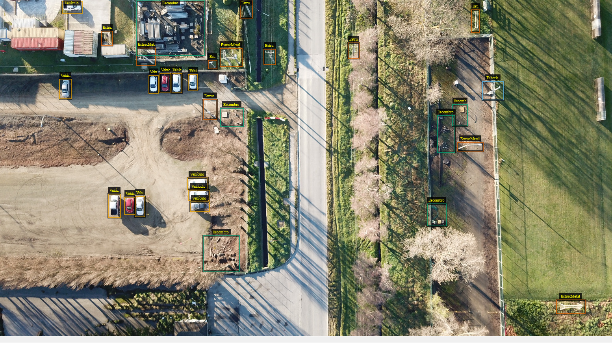
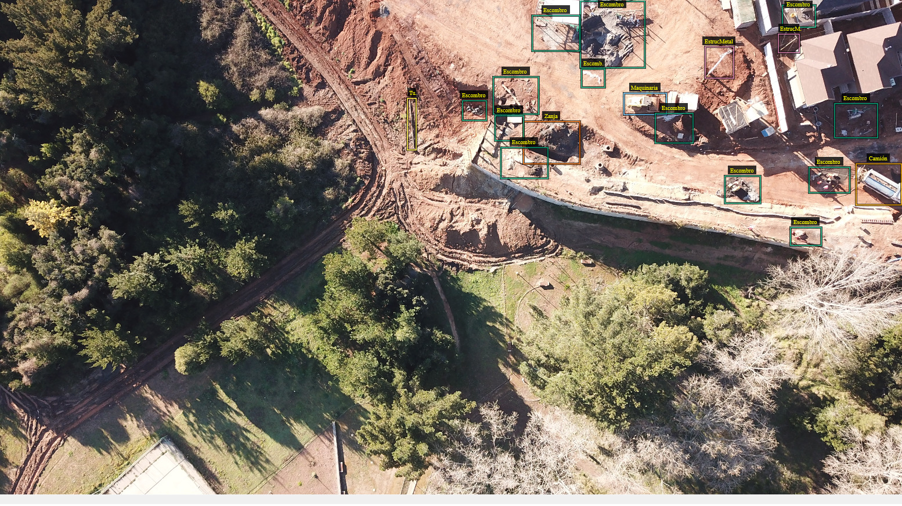
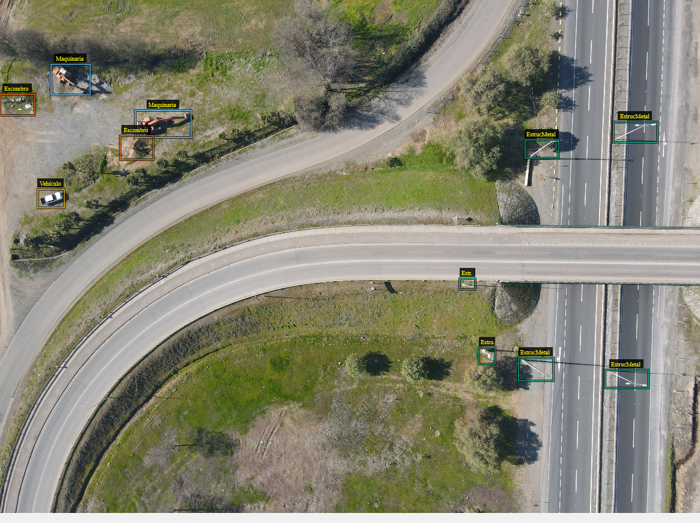
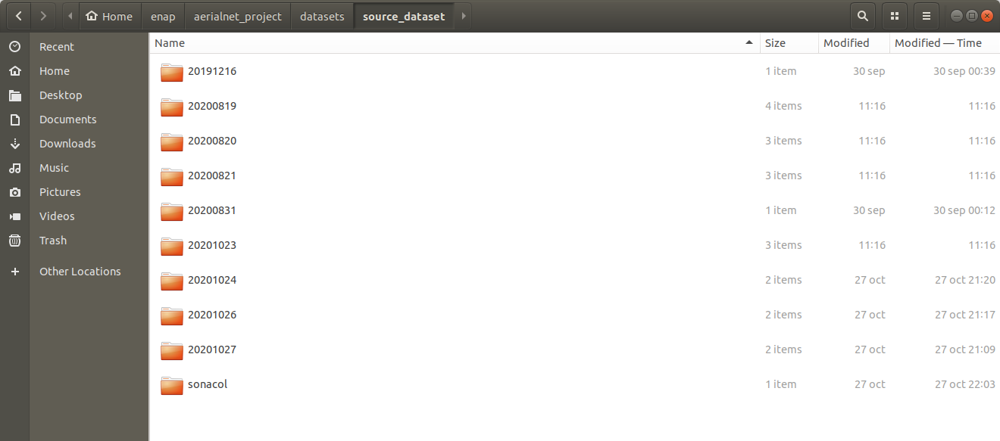

# AERIALNET

## 1. Give execution permision to scripts
```sh
chmod +x scripts/install_aerialnet.sh
chmod +x packages/ml_api/run.sh
chmod +x scripts/run_tfserving.sh
chmod +x scripts/install_nvidia_docker.sh
chmod +x scripts/set_azure_account.sh
```

## 2. Install nvidia-docker
```sh
./scripts/install_nvidia_docker.sh
```

## 3. Create environment
```sh
conda env create -f environment.yml
```

## 4. Activate environment
```sh
conda activate aerialnet_env
```

## 5. Install package
```sh
./scripts/install_aerialnet.sh packages/aerialnet/
```

## 6. Check installation
```sh
python
import aerialnet
aerialnet.__version__
```

## 7. Run tfserving
```sh
./scripts/run_tfserving.sh
```

## 8. Run app
```sh
cd packages/ml_api
./run.sh
```

## 9. Test app
### Local
```sh
curl -X GET "http://localhost:5000/health"
```
```sh
curl -X GET "http://localhost:5000/version"
```
```sh
curl --data "img_url=https://droneimagesstorage.blob.core.windows.net/avionimagefiles/2020-06-01_13-54-40_GPS.jpg" --data "output_img=1" -X POST "http://localhost:5000/predict"
curl --data "img_url=https://droneimagesstorage.blob.core.windows.net/dronblob/andresepachecog@gmail.com/2020/08/11/2020-08-11_08:50:24-3692280-DJI_0339.jpg" --data "output_img=1" -X POST "http://localhost:5000/predict"
```
```sh
curl --data "img_url=https://droneimagesstorage.blob.core.windows.net/dronblob/luis.pirela@kauel.com/2020/08/06/DJI_0436.JPG" --data "output_img=1" -X POST "http://localhost:5000/predict"
```
```sh
curl --data "img_url=https://droneimagesstorage.blob.core.windows.net/blobunitytest/maquinaria.png" --data "output_img=1" -X POST "http://localhost:5000/predict"
curl --data "img_url=https://droneimagesstorage.blob.core.windows.net/blobunitytest/maquinaria_crop.jpg" --data "output_img=1" -X POST "http://localhost:5000/predict"
```

### Azure
```sh
curl -X GET "http://40.74.226.100:5000/health"
```
```sh
curl -X GET "http://40.74.226.100:5000/version"
```
```sh
curl --data "img_url=https://droneimagesstorage.blob.core.windows.net/avionimagefiles/2020-06-01_13-54-40_GPS.jpg" --data "output_img=1" -X POST "http://40.74.226.100:5000/predict"
curl --data "img_url=https://droneimagesstorage.blob.core.windows.net/dronblob/andresepachecog@gmail.com/2020/08/11/2020-08-11_08:50:24-3692280-DJI_0339.jpg" --data "output_img=1" -X POST "http://40.74.226.100:5000/predict"
```
```sh
curl --data "img_url=https://droneimagesstorage.blob.core.windows.net/dronblob/luis.pirela@kauel.com/2020/08/06/DJI_0436.JPG" --data "output_img=1" -X POST "http://40.74.226.100:5000/predict"
```
```sh
curl --data "img_url=https://droneimagesstorage.blob.core.windows.net/blobunitytest/maquinaria.png" --data "output_img=1" -X POST "http://40.74.226.100:5000/predict"
curl --data "img_url=https://droneimagesstorage.blob.core.windows.net/blobunitytest/maquinaria_crop.jpg" --data "output_img=1" -X POST "http://40.74.226.100:5000/predict"
```

## Useful commands to update AI
1. Get api ID and kill it:
    ```sh
    ps aux | grep gunicorn
    kill -9 ID
    ```
2. Upload saved_models.7z and uncompress it:
    ```sh
    7z x saved_model.7z
    ```

AI model was trained using the RetinaNet implementation from fizyr.com: https://github.com/fizyr/keras-retinanet

Example results:





## Para entrenar una nueva versión
1. Actualizar el dataset, guardando cada via.json dentro de la ruta /datasets/source_dataset, en el subdirectorio correspondiente a la fecha del json.


2. Crear subdirectorio para nuevo dataset, dentro de la ruta /datasets/data/. Por ejemplo, para versión 5 del dataset: /datasets/data/v5

3. Dentro del nuevo subdirectorio, crear archivo CLASSES con el detalle de las clases que se considerarán dentro del dataset:
    ```
    0,Animal
    1,Basural
    1,Escombro
    1,MConstrucción
    2,Bus
    3,Camión
    4,Chasis
    5,Cilindro
    6,Estructura
    7,GHorquilla
    8,Juegos
    9,Maquinaria
    10,PalletCaja
    11,Persona
    12,Pickup
    13,Piscina
    14,Poste
    15,SAdvertencia
    16,Tractor
    17,Troncos
    18,Tuberia
    19,Vehículo
    ```
** Las clases disponibles para elegir se encuentran en el archivo /dataset_utils/OFICIAL/VIA-ENAP-PROJECT.json
** Para agrupar clases como una sola, se debe asignar el mismo número. Para el ejemplo, las clases Basural, Escombro y MConstrucción se consideran como una sola clase. Además, se debe crear un nuevo archivo CLASSES_REPORT_NAME con los nombres asociados a cada id:
    ```
    0,Animal
    1,Basural-Escombro-MConstrucción
    2,Bus
    3,Camión
    4,Chasis
    5,Cilindro
    6,Estructura
    7,GHorquilla
    8,Juegos
    9,Maquinaria
    10,PalletCaja
    11,Persona
    12,Pickup
    13,Piscina
    14,Poste
    15,SAdvertencia
    16,Tractor
    17,Troncos
    18,Tuberia
    19,Vehículo
    ```

4. Abrir notebook notebooks/Creación_de_nuevo_dataset_desde_archivos_VIA.ipynb (inicializar jupyter notebook)

5. Ingresar los datos para generar el nuevo dataset y seguir las instrucciones del notebook

6. Crear archivo classes.csv con el siguiente formato:
    ```
    0,0
    1,1
    2,2
    3,3
    4,4
    5,5
    6,6
    7,7
    8,8
    9,9
    10,10
    11,11
    12,12
    13,13
    14,14
    15,15
    16,16
    17,17
    18,18
    19,19
    ```
** En este caso el dataset contiene 19 clases

7. Duplicar el último archivo de AerialNet_vx.ipynb y modificar los parámetros según corresponda. Luego seguir las instrucciones del notebook.

## Para crear nueva versión de producción
1.- Actualizar versión en /home/aikauel/enap/aerialnet_project/packages/aerialnet/aerialnet/VERSION

2.- Actualizar lectura y filtrado de clases en /home/aikauel/enap/aerialnet_project/packages/aerialnet/aerialnet/utils/predictions.py

3.- Actualizar clases en /home/aikauel/enap/aerialnet_project/packages/aerialnet/aerialnet/utils/classes.py

4.- Actualizar id de clases en /home/aikauel/enap/aerialnet_project/packages/aerialnet/aerialnet/data/classes.csv

5.- Actualizar versión del modelo de IA en /home/aikauel/enap/aerialnet_project/packages/ml_api/api/controller.py

6.- Generar saved_model y guardarlo en /home/aikauel/enap/aerialnet_project/saved_models

7.- Continuar desde el punto 4 de la primera sección (Activate environment)